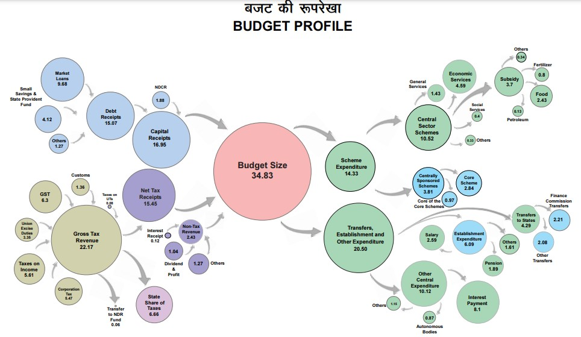
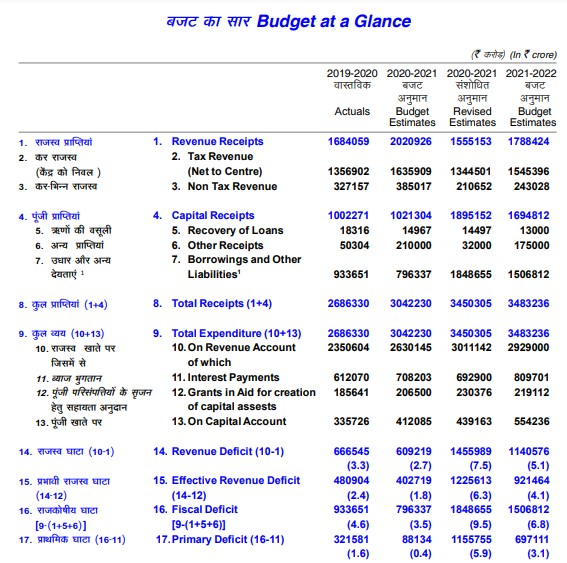
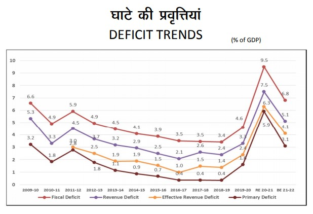

## Union Budget: Aam aadmi Interpretation - Part I
February 6, 2021

In India, few things garner as much interest as these: Cricket matches, Bollywood, and of course the Budget. It’s that time of the year again, as Union Finance Minister, Nirmala Sitharaman presented the Union Budget for FY22 in the Budget Session of Parliament. As ever, the presentation of the Budget was accompanied with hair-splitting analysis across the media, experts from the industry. 

I like numbers though, and I observed how the numbers translate into the minister’s speech in Parliament. So this is the first of a two-part article on the Budget, where we look at the numbers and what they mean. 

The first thing we need to know what sort of money the Government has and how it is stored. The Government of India has three kinds of sources, or funds: 
1. **Consolidated Fund of India**: In layman terms this is the purse of the Government of India. Expenditures such as allocation to various ministries, for various social and educational schemes are drawn against the Consolidated Fund. All incomes also go into this fund. No amount can be withdrawn from this fund without the approval of the Parliament.
2. **Contingency Fund of India**: This is a fund which is kept for emergency usage, and the President of India is authorized to transfer from the Contingency Fund to the Consolidated Fund in times of need such as war, severe economic crises, etc. This assumes importance this year due to the *global pandemic* we have been subjected to.	
3. **Public Account**: This is basically money that the Government has borrowed from various sources such as Provident Funds, etc. This money doesn’t belong to the government and must be returned back to the borrowers.

Now, let’s look at the raw data:

This is taken from the [official site for the budget](https://www.indiabudget.gov.in/doc/Budget_at_Glance/bag4.pdf) prepared by the finance ministry.

Let’s have a look at the various components with a household analogy. Just like a household has its income and expenditure, the Government of India too has its own expenditures and revenues. Typically, the Government’s expenditures overreach its incomes, and thus it is in deficit, and this type of a budget is called a deficit budget. For the expenditure side of things, the Government has two broad types: 
1. **Revenue Expenditures**: I look at this as operational expenditures. You pay your electricity bill, your phone bill, etc., so that these keep working. Likewise the government needs to pay *salaries and pensions* to its staff, ministers, lawmakers, etc. Also, the government spends money on *subsidies* on food, your cooking gas, fertilisers in the agri sector. Another expenditure under this head is *payment of interest on loans*, similar to EMIs you might have to pay. Finally, the government also pays for *various schemes* in the social sector (think *Swacch Bharat, Sarva Siksha, Ayushman Bharat* etc.)
2. **Capital Expenditures**: These are expenses used for *asset creation*. Say you spend some money on your higher degree. This is something that will benefit you (hopefully) in the long run, and can even be useful for wealth creation later on. The government spends money on *infrastructure projects* like roads, bridges, dams, canals, rail-lines, etc. These will be beneficial for facilitating trade and commerce, improve the life of citizens, etc.
In the figure above, the right hand side is the estimated expenditure of the government on these various expenses. It’s not that difficult to figure out under which of the two heads those bubbles fall.

Now for revenues the story is a bit more interesting. When we think revenue of the government, one word comes to mind: *Taxes*. While that is true, the government does have other much larger sources of receipts:
1. **Revenue Receipts**: This a term encompassing government revenues which are recurring (like your salary). There are two kinds of revenue receipts.
	- **Tax revenues**: Ah yes the old “humare paiso se hi to sarkar kamati hain”! Tax revenues include *income taxes* from individuals, *corporate tax* levied on companies, *excise duty, customs* (levied on goods that are imported), and finally the *GST*. Note, the Union Government collects GST, but also has to disburse the GST to various states, hence you see the bubble called *“State share of taxes”*.
	- **Non-tax revenues**: We all know about PSUs don’t we (“bhai PSU me naukri chahiye”)? These are corporations owned and/or run by the governments. They too earn something (or do they?), and that goes into *non-tax revenues*. Moreover the government also invests in shares and dividends, and earns *revenue through such investments*. Note how small these are compared to tax revenues. PSUs are rapidly becoming liabilities for the government, and this explains the Governments desire to divest some of them.

2. **Capital Receipts**: These are essentially one-time earnings for the Government. Lets say you visit your granny, and she slips you a 500-rupee note when your mother isn’t looking. Unfortunately for the government it doesn’t have a benevolent granny like you and I do.
	- **Non-debt Capital Receipts (NDCR)**: Remember those PSUs? Well they are *assets* for the Government (ahem, ahem), and sometimes are sold off to raise money. We will delve deeper into this when we discuss the Governments plans to divest money from various PSUs as outlined this year. Another component of NDCRs is *recovery of loans* given out by the government. You can see how small a component this is in the grand scheme of things for the government. 
	- **Debt-creating Capital Receipts**: So far we have talked about how the government spends and how it earns. It so happens even after all of this, there is a shortfall of money. The Government simply *doesn’t earn enough to finance all its schemes*. What can be done in such a situation? The government thus borrows the remaining amount from the market, banks, or even foreign agencies. Obviously this places the Government in *debt*, and this kind of receipts is thus named. We will talk about this debt or deficit in a later section.

Now, let’s have a look at the actual breakup:

[This](https://www.indiabudget.gov.in/doc/Budget_at_Glance/bag1.pdf) table show you the actual figures for FY20 (ending March 2020), the Budget Estimates for FY21 (last year’s budgets) and the actual figures for FY21 (the current fiscal year).

So like we pointed out earlier, borrowing creates a debt on the government. How do we measure this? Well there are a couple of ways of doing this. We can talk about the Revenue deficit. This is the difference between the Revenue Expenditure and the Revenue Receipt. For FY22 (this budget) this is 11.4 lakh crore. This means that the government will spend 11.4 lakh crores more on regular expenses than it will earn.

But this doesn’t paint the complete picture. It’s not like the government is just going to be spending money on day to day activities, nor will it earn only from revenue receipts. It will be spending on infrastructure and facilities too. Those are future assets and will add value to our nation. So we have a better measure of deficit, and we call that Fiscal Deficit. You have probably seen this term thrown everywhere on the media over the last few days. This just expresses the difference between the total expenditure of the government (both on capital and revenue expenditures) and the sum of revenue receipts and NDCR. The Government uses this term because it expresses that the government has used up all avenues of income and the only option now is to borrow from the market. In practice this figure expressed as a percentage of GDP (figure in brackets).

[Source](https://www.indiabudget.gov.in/doc/Budget_at_Glance/bag2.pdf)

For FY22 (this budget) that figure is 9.21 lakh crores. Notice this is a lot smaller than the revenue deficit. Now let’s have a look at this figure compared to last year. See how the estimated fiscal deficit last year was 3.5% of the GDP, and in reality turned out to be a staggering 9.5%. Well as with all things in the year last, this is due to COVID-19. The government had to borrow a lot more to support healthcare, pay for schemes for workers, and give stimulus to industries and banks. One more thing to point out here, both the International Monetary Fund, as well as the Finance Commission had set to achieve a fiscal deficit target of 3% through FY13-14. The Government was well on track to achieve this target, but it got upset due to the pandemic. Due credit must be given to the government for its decision to prioritise of the revival of the economy, focus on healthcare and jobs instead of trying to achieve this target. (Although some might argue this was the only way to go this year)

This concludes this part of a two-part article on the budget, and in the next part we will look at the specific spending on each sector made in the Finance Minister’s budget and what they mean.
